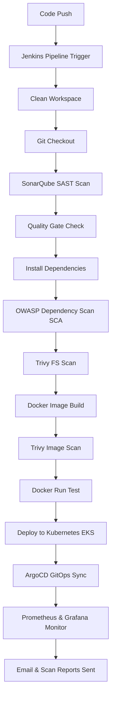

# 🎬 DevSecOps Netflix Clone Deployment Project

<div align="center">
  
  <br><br>
  <a href="http://netflix-clone-with-tmdb-using-react-mui.vercel.app/">
    
  </a>
</div>

---

[](https://react.dev/)
[](https://www.typescriptlang.org/)
[](https://vitejs.dev/)
[](https://mui.com/)
[](https://www.jenkins.io/)
[](https://www.sonarqube.org/)
[](https://trivy.dev/)
[](https://www.docker.com/)
[](https://kubernetes.io/)
[](https://argoproj.github.io/cd/)
[](https://prometheus.io/)
[](https://grafana.com/)

This repository contains a full-stack **Netflix Clone** built using **React**, **TypeScript**, **Redux Toolkit**, and **Material UI (MUI)**, integrated with a complete, enterprise-grade **DevSecOps CI/CD pipeline**. The application is containerized, scanned at multiple levels for security vulnerabilities, deployed to a **Kubernetes** cluster (AWS EKS), monitored using **Prometheus & Grafana**, and managed via GitOps with **ArgoCD**.


## 🛡️ DevSecOps Pipeline Architecture

Below is the automated pipeline workflow executed on every code commit:



---

## 📂 Project Structure

```text
├── Kubernetes/                 # Kubernetes manifest files
│   ├── deployment.yml          # Netflix App Deployment (2 replicas)
│   ├── service.yml             # NodePort Service mapping port 80 to 30007
│   └── node-service.yaml       # Prometheus node-exporter service configuration
├── public/                     # Static assets (including screenshots)
│   └── assets/                 # Banner, logos, and UI screenshot images
├── src/                        # React frontend components & styling
├── Dockerfile                  # Multi-stage production container build instructions
├── .dockerignore               # Files excluded from the docker build context
├── .env.example                # Sample environment configuration file
├── package.json                # Frontend package dependencies & build scripts
├── pipeline.txt                # Complete Jenkins Declarative Pipeline Script
├── tsconfig.json               # TypeScript configurations
├── vercel.json                 # Vercel deployment metadata
└── vite.config.ts              # Vite bundler configurations
```

---

## 🚀 DevSecOps Project Phases

<details>
<summary><b>Phase 1: Initial Setup & Local Containerization</b></summary>

### 1. Launch EC2 Instance
* Provision an AWS EC2 instance running **Ubuntu 22.04 LTS** (t2.large is recommended to support Jenkins, SonarQube, and monitoring tools).
* Open inbound security group ports: `22` (SSH), `80` (HTTP), `8080` (Jenkins), `9000` (SonarQube), `9090` (Prometheus), `3000` (Grafana), and `30007` (Kubernetes App).
* Connect to your instance via SSH.

### 2. Clone the Repository
```bash
git clone https://github.com/ankit-tiwari-01/DevSecOps_netflix_application.git
cd DevSecOps_netflix_application
```

### 3. Install Docker & Run the App
Setup Docker on the host machine:
```bash
sudo apt-get update
sudo apt-get install docker.io -y
sudo usermod -aG docker $USER
newgrp docker
sudo chmod 777 /var/run/docker.sock
```

### 4. Obtain TMDB API Key
1. Go to [The Movie Database (TMDB)](https://www.themoviedb.org/) and create an account.
2. Under Profile Settings -> **API**, request an API key.
3. Once generated, copy your API key.

Build and run the container locally by passing the API key as a build argument:
```bash
docker build --build-arg TMDB_V3_API_KEY=<your_tmdb_api_key> -t netflix .
docker run -d --name netflix -p 8081:80 netflix:latest
```
Access the application locally at `http://<your-server-ip>:8081`.
</details>

<details>
<summary><b>Phase 2: Security & Static Analysis Setup</b></summary>

### 1. Run SonarQube
Deploy SonarQube as a container:
```bash
docker run -d --name sonar -p 9000:9000 sonarqube:lts-community
```
Access the dashboard at `http://<your-server-ip>:9000`. Login credentials default to `admin` / `admin` (you will be prompted to change it immediately).

### 2. Install Trivy (Vulnerability Scanner)
Configure the Aqua Security repo and install Trivy:
```bash
sudo apt-get install wget apt-transport-https gnupg lsb-release
wget -qO - https://aquasecurity.github.io/trivy-repo/deb/public.key | sudo apt-key add -
echo deb https://aquasecurity.github.io/trivy-repo/deb $(lsb_release -sc) main | sudo tee -a /etc/apt/sources.list.d/trivy.list
sudo apt-get update
sudo apt-get install trivy -y
```

Scan the filesystem or docker images manually:
```bash
# Scan filesystem
trivy fs .
# Scan built image
trivy image netflix:latest
```
</details>

<details>
<summary><b>Phase 3: CI/CD Pipeline Automation with Jenkins</b></summary>

### 1. Install Java & Jenkins
```bash
# Install Java JDK 17
sudo apt update
sudo apt install fontconfig openjdk-17-jre -y

# Install Jenkins
sudo wget -O /usr/share/keyrings/jenkins-keyring.asc \
https://pkg.jenkins.io/debian-stable/jenkins.io-2023.key
echo deb [signed-by=/usr/share/keyrings/jenkins-keyring.asc] \
https://pkg.jenkins.io/debian-stable binary/ | sudo tee \
/etc/apt/sources.list.d/jenkins.list > /dev/null
sudo apt-get update
sudo apt-get install jenkins -y
sudo systemctl start jenkins
sudo systemctl enable jenkins
```
Access Jenkins at `http://<your-server-ip>:8080` and unlock it using the administrator password found in `/var/lib/jenkins/secrets/initialAdminPassword`.

### 2. Install Required Jenkins Plugins
Navigate to **Manage Jenkins** -> **Plugins** -> **Available Plugins** and install:
1. **Eclipse Temurin Installer**
2. **SonarQube Scanner**
3. **NodeJS Plugin**
4. **Email Extension Plugin**
5. **Docker, Docker Commons, Docker Pipeline, Docker API, docker-build-step**

### 3. Configure Global Tools & Credentials
* **JDK:** Manage Jenkins -> Tools -> Add JDK (Name: `jdk17`, Install automatically from Adoptium).
* **NodeJS:** Manage Jenkins -> Tools -> Add NodeJS (Name: `node16`, Version: `NodeJS 16.x.x`).
* **SonarQube Scanner:** Manage Jenkins -> Tools -> Add SonarQube Scanner (Name: `sonar-scanner`).
* **Credentials:** Add Secret Text under System Credentials:
  - `Sonar-token` (Generate token from SonarQube Security settings).
  - `docker` (Secret text or username/password representing your DockerHub login credentials).

### 4. Create Jenkins Pipeline
Create a new Pipeline job, copy the contents of `pipeline.txt` into the pipeline definition script, and trigger the build.
</details>

<details>
<summary><b>Phase 4: Monitoring Infrastructure</b></summary>

### 1. Install Prometheus
Create a dedicated user and extract Prometheus binaries:
```bash
sudo useradd --system --no-create-home --shell /bin/false prometheus
wget https://github.com/prometheus/prometheus/releases/download/v2.47.1/prometheus-2.47.1.linux-amd64.tar.gz
tar -xvf prometheus-2.47.1.linux-amd64.tar.gz
cd prometheus-2.47.1.linux-amd64/
sudo mkdir -p /data /etc/prometheus
sudo mv prometheus promtool /usr/local/bin/
sudo mv consoles/ console_libraries/ /etc/prometheus/
sudo mv prometheus.yml /etc/prometheus/prometheus.yml
sudo chown -R prometheus:prometheus /etc/prometheus/ /data/
```

Create a systemd unit configuration file `/etc/systemd/system/prometheus.service`:
```ini
[Unit]
Description=Prometheus
Wants=network-online.target
After=network-online.target

[Service]
User=prometheus
Group=prometheus
Type=simple
Restart=on-failure
ExecStart=/usr/local/bin/prometheus \
  --config.file=/etc/prometheus/prometheus.yml \
  --storage.tsdb.path=/data \
  --web.console.templates=/etc/prometheus/consoles \
  --web.console.libraries=/etc/prometheus/console_libraries \
  --web.listen-address=0.0.0.0:9090 \
  --web.enable-lifecycle

[Install]
WantedBy=multi-user.target
```
Enable and start the service:
```bash
sudo systemctl daemon-reload
sudo systemctl enable prometheus --now
```

### 2. Install Node Exporter (Host System Metrics)
```bash
sudo useradd --system --no-create-home --shell /bin/false node_exporter
wget https://github.com/prometheus/node_exporter/releases/download/v1.6.1/node_exporter-1.6.1.linux-amd64.tar.gz
tar -xvf node_exporter-1.6.1.linux-amd64.tar.gz
sudo mv node_exporter-1.6.1.linux-amd64/node_exporter /usr/local/bin/
rm -rf node_exporter*
```

Create a systemd service file `/etc/systemd/system/node_exporter.service`:
```ini
[Unit]
Description=Node Exporter
Wants=network-online.target
After=network-online.target

[Service]
User=node_exporter
Group=node_exporter
Type=simple
Restart=on-failure
ExecStart=/usr/local/bin/node_exporter --collector.logind

[Install]
WantedBy=multi-user.target
```
Start Node Exporter:
```bash
sudo systemctl daemon-reload
sudo systemctl enable node_exporter --now
```

### 3. Install Grafana
```bash
sudo apt-get install -y apt-transport-https software-properties-common
wget -q -O - https://packages.grafana.com/gpg.key | sudo apt-key add -
echo "deb https://packages.grafana.com/oss/deb stable main" | sudo tee -a /etc/apt/sources.list.d/grafana.list
sudo apt-get update
sudo apt-get install grafana -y
sudo systemctl enable grafana-server --now
```
Access Grafana at `http://<your-server-ip>:3000` (Default Credentials: `admin`/`admin`).
* Add **Prometheus** as a datasource (`http://localhost:9090`).
* Import dashboard **1860** (Node Exporter Full dashboard) to visualize infrastructure status.
</details>

<details>
<summary><b>Phase 5: Kubernetes & GitOps Deployment with ArgoCD</b></summary>

### 1. Provision Cluster
Setup Kubernetes (minikube, kind, or an AWS EKS Cluster). 

### 2. Install Node Exporter using Helm on Cluster
```bash
helm repo add prometheus-community https://prometheus-community.github.io/helm-charts
kubectl create namespace prometheus-node-exporter
helm install prometheus-node-exporter prometheus-community/prometheus-node-exporter --namespace prometheus-node-exporter
```

Update `/etc/prometheus/prometheus.yml` to scrape EKS node metrics:
```yaml
  - job_name: 'Netflix'
    metrics_path: '/metrics'
    static_configs:
      - targets: ['<EKS_Node_IP>:9100']
```
Reload Prometheus configs:
```bash
curl -X POST http://localhost:9090/-/reload
```

### 3. Deploy App using ArgoCD
1. Install ArgoCD on the Kubernetes cluster.
2. Link your Github Repository containing the Kubernetes manifest directory `Kubernetes/`.
3. Create an application in ArgoCD:
   * **Project**: `default`
   * **Sync Policy**: `Automatic` (Self-healing & Pruning enabled)
   * **Source Repository**: `https://github.com/ankit-tiwari-01/DevSecOps_netflix_application.git`
   * **Path**: `Kubernetes`
   * **Destination**: In-cluster namespace.
4. Access the application on port `30007` via any Node IP of your EKS cluster.
</details>

<details>
<summary><b>Phase 6: Notifications & Cleanups</b></summary>

### 1. Email Notifications
In the `pipeline.txt` post-build configuration, update the recipient email:
```groovy
post {
    always {
        emailext attachLog: true,
            subject: "'${currentBuild.result}'",
            body: "Project: ${env.JOB_NAME}<br/>Build Number: ${env.BUILD_NUMBER}<br/>URL: ${env.BUILD_URL}<br/>",
            to: 'your-email@example.com', 
            attachmentsPattern: 'trivyfs.txt,trivyimage.txt'
    }
}
```

### 2. Cleanup
Always terminate AWS EC2 instances, EKS clusters, and load balancers when they are no longer in use to prevent unexpected billing.
```bash
# Stop containers
docker stop netflix sonar
docker rm netflix sonar
```
</details>

---

## 📈 Dashboard Previews
Once setup is complete, you can monitor the application environment in real time:

* **Netflix Application Feed:**


* **Vulnerability & Pipeline Scanning Status:**
Scan results from SonarQube, Trivy File System, and Trivy Container Image are generated during the build stages and emailed directly to your inbox with full reports (`trivyfs.txt` and `trivyimage.txt`).
